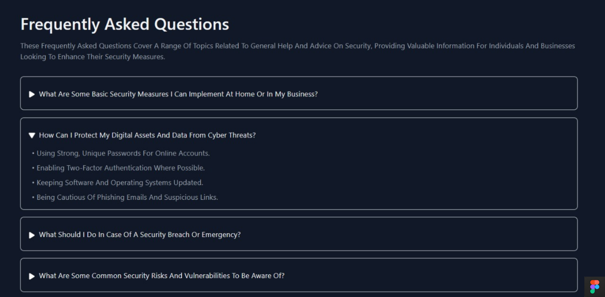
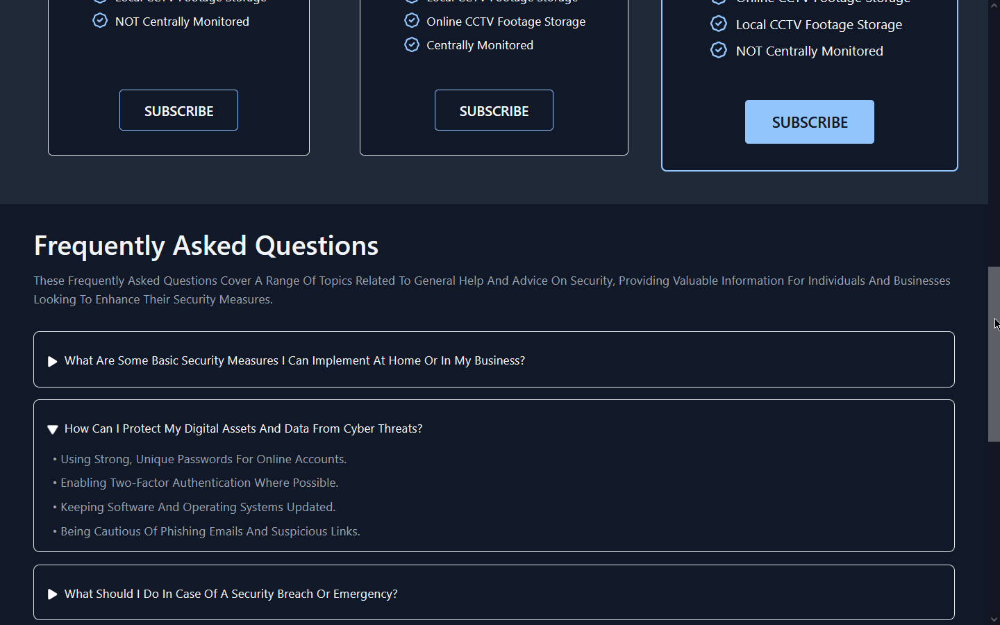
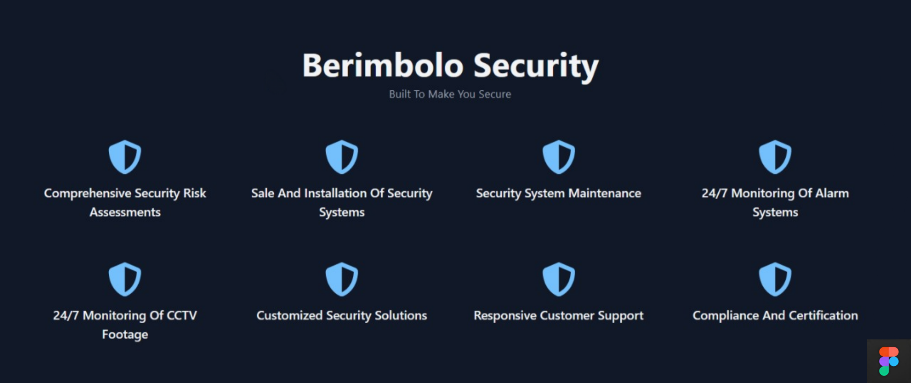

# Ahmad Ali Othman 3-3

# Unit 6 - Activity Three

# Seeking Feedback

## Introduction

After completing the initial designs for Berimbolo Security's website, I will begin the process of seeking feedback to enhance the quality and appropriateness of the designs. This involves showing the designs to relevant stakeholders, gathering and analyzing the feedback received, and identifying areas that could be improved. Based on this feedback, I will further develop and refine the designs, ensuring they meet the users' needs and are fit for purpose. Throughout this process, I will justify my design decisions, explaining how they respond to the feedback and considering alternative options. Additionally, I will detail which suggested changes were implemented, which were not, and the reasoning behind these decisions.

## Feedback from Users:

### Feedback from User 1

#### _Positive Feedback:_

-   The animations on the **homepage** and the '**About Us**' page, implemented using the [AOS](https://github.com/michalsnik/aos) library, were appreciated for their quality and effectiveness.

#### _Areas for Improvement:_

-   The fixed footer was reported to overlap with the content during navigation, causing a disruption in the user experience. This feedback is under consideration for improving the layout of the website.
-   The color scheme was not found appealing by the user. However, this feedback will not be incorporated as the current color scheme aligns with the brand identity and has been positively received by other users.

### Feedback from User 2

#### _Areas for Improvement:_

-   The user suggested that the FAQ page could be integrated into the homepage to reduce redundancy and streamline information access. This feedback is under consideration.
-   The hero section was reported to contain excessive content, potentially overwhelming users. Simplifying this section is under consideration to enhance clarity and focus on key messages.

### Feedback from User 3

#### _Positive Feedback:_

-   The responsive design across most pages was praised, ensuring a seamless user experience across various devices.
-   The color scheme was appreciated for its aesthetic appeal, contributing to the overall attractiveness of the website.

### Feedback Conclusion:

This feedback provides valuable insights into the user experience of the website highlighting areas for potential improvement. Each piece of feedback will be carefully considered to enhance the design and functionality of the website, with the aim of creating a user-friendly, informative, and engaging platform for Berimbolo Security's services and products.

## Further Development Based on User Feedback:

Based on the feedback received from the users, I will further develop and improve the designs as follows:

1. **Addressing the Overlapping Footer Issue**: I will revise the layout of the website to ensure that the fixed footer does not overlap with the content during navigation, thus improving the overall user experience.

**Before Fixation:**

**After Fixation:**

2. **Considering Integration of FAQ Page into Homepage**: I will explore the possibility of integrating the FAQ page into the homepage to reduce redundancy and streamline information access, enhancing user convenience.

**Before integration:**

**After integration:**

3. **Simplifying the Hero Section**: To address the feedback regarding the excessive content in the hero section, I will simplify this area to focus on key messages, ensuring clarity and preventing user overwhelm.

**Before simplification:**

**After simplification:**

4. **Maintaining the Color Scheme**: While some users expressed dissatisfaction with the color scheme, I will maintain it as it aligns with the brand identity and has been positively received by other users. However, I will consider subtle adjustments if necessary to address any specific concerns.

5. **Continuing Responsive Design**: I will ensure continued responsiveness across all pages to maintain a seamless user experience across various devices, as praised by one of the users.

By implementing these improvements, I aim to enhance the overall quality and appropriateness of the website designs, better meeting the needs of Berimbolo Security and its users.

## Justification of Design Decisions:

1. **Addressing the Overlapping Footer Issue**:

    - **Meeting User Needs**: By resolving the overlapping footer issue, we ensure a smoother navigation experience for users, reducing disruptions and enhancing usability.
    - **Consideration of Alternatives**: Alternative options were considered, such as adjusting the footer position, but after careful evaluation, we decided that revising the layout was the most effective solution to maintain consistency across all pages.
    - **Changes Made**: The design was updated to ensure that the footer be at the bottom of the page after all content ends to avoid overlapping with the content during navigation, as depicted in the "After Fixation" image. This decision was made to prioritize user experience and ensure seamless navigation.

2. **Integration of FAQ Page into Homepage**:

    - **Meeting User Needs**: Integrating the FAQ page into the homepage reduces redundancy and streamlines information access, meeting users' needs for quick access to commonly asked questions.
    - **Consideration of Alternatives**: We considered keeping the FAQ page separate or integrating it into a dropdown menu, but integrating it directly into the homepage was deemed the most user-friendly option.
    - **Changes Made**: The FAQ section was seamlessly integrated into the homepage, as shown in the "After Integration" image, improving user convenience and reducing the need for navigation between pages.

3. **Simplifying the Hero Section**:

    - **Meeting User Needs**: Simplifying the hero section addresses user feedback about excessive content, enhancing clarity and ensuring that key messages are prominent and easily digestible.
    - **Consideration of Alternatives**: We explored options such as reducing the number of elements or dividing the content into multiple sections, but simplifying the existing section was deemed the most effective approach to maintain a clean and focused design.
    - **Changes Made**: The hero section was streamlined to focus on key messages, as depicted in the "After Simplification" image and the previous content of it will be moved into another section of the website. This decision was made to prioritize clarity and prevent user overwhelm, aligning with user feedback.

4. **Maintaining the Color Scheme**:

    - **Meeting User Needs**: While some users expressed dissatisfaction with the color scheme, maintaining it aligns with the brand identity and ensures consistency across the website, meeting the needs of users familiar with the brand.
    - **Consideration of Alternatives**: We considered alternative color schemes suggested by users like teal and purple, but ultimately decided to maintain the current scheme to preserve brand identity and consistency.
    - **Changes Not Made**: The color scheme remained unchanged to maintain brand consistency and positive feedback from other users, prioritizing brand recognition and identity over individual preferences.

5. **Continuing Responsive Design**:
    - **Meeting User Needs**: Continuing responsive design ensures a seamless user experience across various devices, meeting the needs of users accessing the website from different platforms.
    - **Consideration of Alternatives**: No alternative options were considered as responsive design is essential for modern websites to adapt to different screen sizes and devices.
    - **Changes Made**: Responsive design principles were maintained across all pages to ensure a consistent and user-friendly experience, aligning with positive feedback from users.

## Conclusion:

In conclusion, each design decision was made with careful consideration of user feedback, ensuring that the website meets the needs of Berimbolo Security's users and remains fit for purpose. Alternative options were evaluated, and changes were implemented based on their effectiveness in enhancing usability, clarity, and consistency across the website.
