# Ahmad Ali Othman 3-3

# Unit 6 - Activity Two

# Design Documentation

## User Requirements:

-   modern and engaging design
-   help improve the brand awareness of the company
-   provide potential customers with information about:

    -   the company
    -   the services offered
    -   general help and advice on security

-   allow customers to contact the company to ask for further information
-   an adaptive layout for users accessing with either mobile or desktop browsers
-   accessibility features to enable a wide range of users to use the site easily.

## Identification of User Requirements:

-   **Modern and Engaging Design**: The website design should be modern, visually appealing, and engaging to capture the attention of visitors.

-   **[Brand Awareness](#sources-and-references)**: The website should help improve the brand awareness of Berimbolo Security by showcasing its services, expertise, and unique selling points. High brand awareness can lead to a brand being 'on top of mind' when the consumer thinks about security products and services. Brand awareness is crucial because it sets the tone for a person’s entire experience with your brand. It creates a community that generates word-of-mouth buzz. As your brand awareness strategy matures, you’ll find that the most effective awareness drivers come from your fans.This can be satisfied in the about page.

-   **Information Accessibility**: Potential customers should easily access information about the company, the services offered, and general security advice. This can be satisfied in the about page and the plans and in FAQs sections in the homepage.

-   **Contact Option**: Customers should have a clear option to contact the company for further inquiries or assistance. This can be satisfied in the contact page.

-   **Adaptive Layout**: The website should have an adaptive layout to ensure seamless user experience across various devices, including desktops, tablets, and smartphones. This can be satisfied by using responsive design principles and utilizing tailwind responsive features in addition to media queries and the power of vanilla css.

-   **Accessibility Features**: Accessibility features should be incorporated to ensure that users with disabilities can easily navigate and use the website. This will be achieved through using alt attributes on images and adding some additional accessibility features.

## Visual Designs for the Pages:

The website will include:

### Homepage:

The homepage will have a modern and engaging design with a UI.

#### Hero section

Will showcase the services offered by the company such as security risk assessments, sale and installation of security systems, maintenance, and monitoring services.

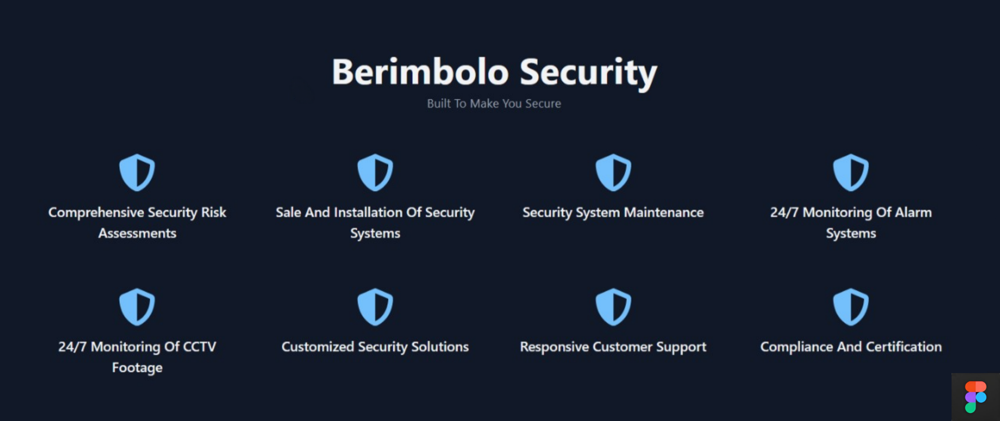

#### Pricing and Plans

This section of the website displays the different security packages offered by Berimbolo Security, including Basic, Standard, and Deluxe plans. Each plan is clearly outlined with its respective features and pricing, making it easy for potential customers to compare and select the option that best suits their needs. Each plan has a clear call-to-action button labeled "**SUBSCRIBE**" to facilitate easy sign-up for users. This section also includes a toggle between "**Presets**" and "**Custom**" to cater to users who may want to customize their security solutions. The overall design is clean and modern, ensuring the information is accessible and engaging for users.

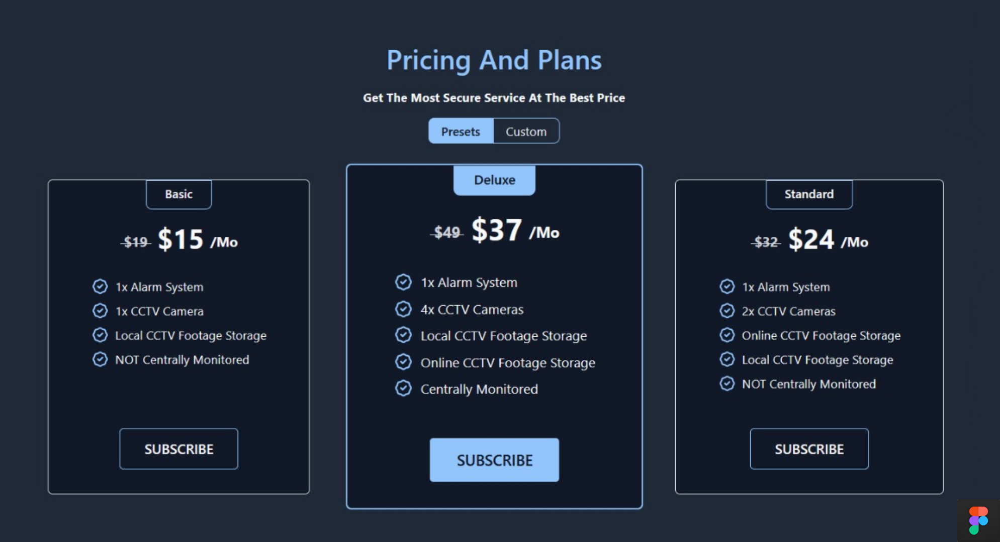

#### FAQs

Contains some frequently asked questions that cover a range of topics related to general help and advice on security, providing valuable information for individuals and businesses looking to enhance their security measures.

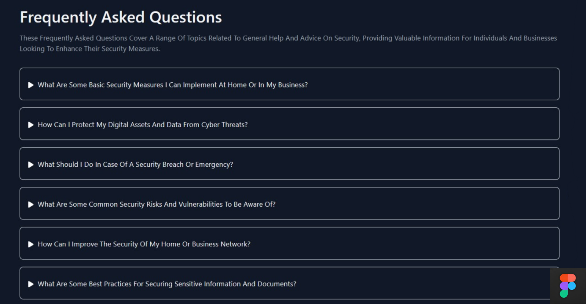

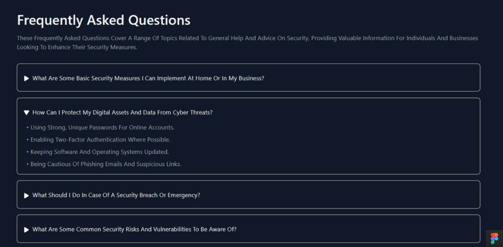

### Navigation bar

A clear navbar that will include links to the Homepage, About Us page, and Contact Us page.

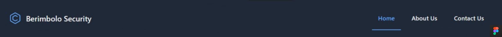

### About Page:

This page will detail the services offered by Berimbolo Security. Each service mentioned in the hero section will have a dedicated section with a detailed description and related images in the about page.

#### Services Offered

Contains information about each service and provides the user with a picture representing the service.

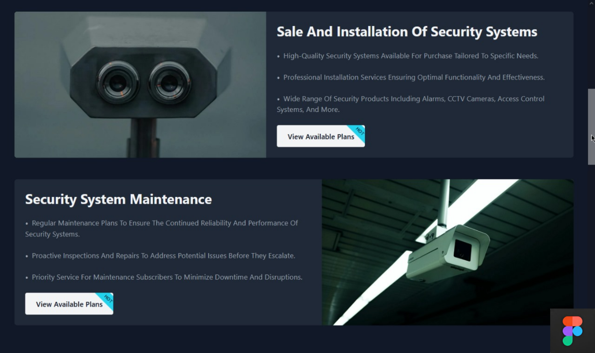

#### Call to Action Buttons

CTA Buttons encouraging visitors to contact the company or request a custom plan.

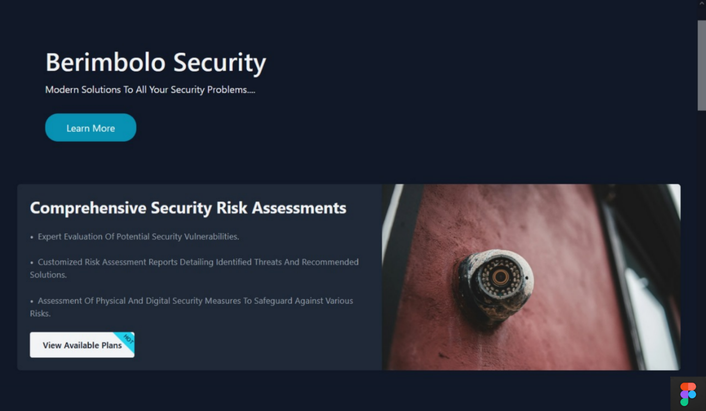

### Footer

The footer will provide easy navigation to the homepage via a link and display a copyright notice, ensuring brand visibility and legal protection.

### Contact Page

This page will have a contact form for customers to request more information or schedule an assessment and planning meeting for custom security systems. Containing fields for name, email, and the message. It will also include the company's contact information such as company's address, phone number, and email address.

## Alternative Design Options:

1. **Video Background**: Implement a video background on the homepage showcasing the company's services and team in action, similar to **[Vivint](https://www.vivint.com/)**'s website.

2. **Interactive Security Quiz**: An interactive quiz could be added to help users determine the best security system for their needs, similar to **[ADT](https://www.adt.com/quiz)**'s website.

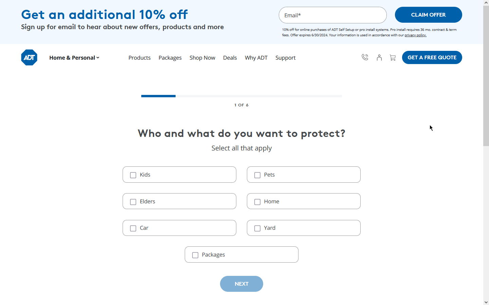

3. **Live Chat Support**: Integrate a live chat feature to provide real-time assistance to website visitors, similar to **[Vivint](https://www.vivint.com/)**'s and **[ADT](https://www.adt.com/)**'s website.

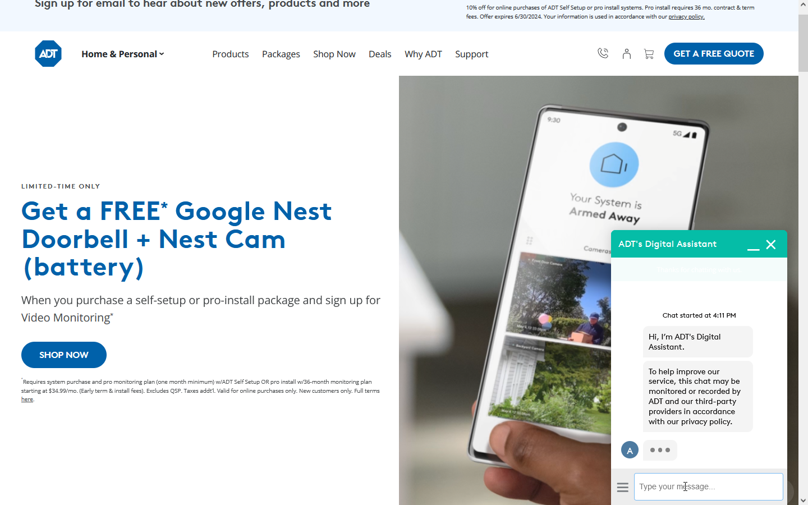

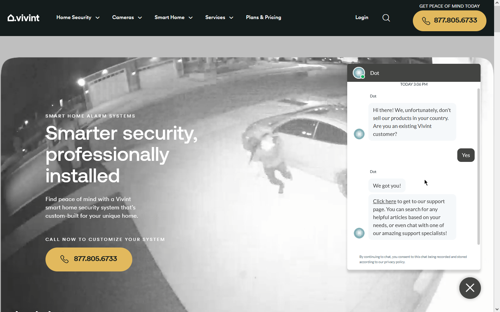

4. **Light Mode:** Considering the preferences of some users for a brighter and more traditional look, an alternative light theme could be developed for the website. It's a good option for users who find dark themes to be harder on their eyes.

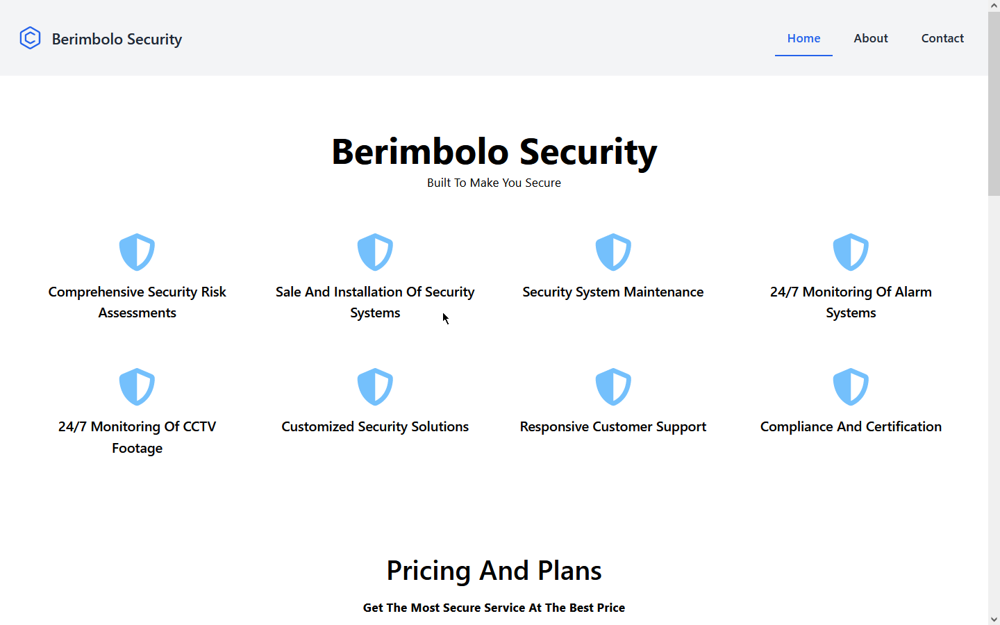

## Technical documentation:

The website will be developed using responsive design principles - using media queries - to ensure it displays correctly on various devices. It will also include accessibility features to enable a wide range of users to use the site easily.

-   **Development**: The website will be developed using **[React](https://react.dev/)** for the frontend, with **[Tailwind CSS](https://tailwindcss.com/)** for styling and **[Vite](https://vitejs.dev/)** asset bundling. This website will have no backend (frontend only) and will be hosted on **[Github Pages](https://pages.github.com/)** for free.

-   **Responsiveness**: The website will be responsive, using **[media queries](https://developer.mozilla.org/en-US/docs/Web/CSS/CSS_media_queries)** to ensure proper display on various devices.

-   **Accessibility**: Accessibility features will be incorporated, such as alt **[⁵](#sources-and-references)** text for images, sufficient color contrast, and keyboard-friendly navigation.

-   **Optimized Performance**: Optimize website speed and performance by minimizing file sizes, leveraging browser caching, and utilizing content delivery networks (CDNs) and local package installation minimizing the website bundle using the power of vite and **[SWC](https://swc.rs/)** **[plugin](https://vitejs.dev/plugins/#vitejs-plugin-react-swc)** for faster compilation.

-   **Cross-Browser Compatibility**: Test the website on various browsers (Chrome, Firefox, Edge) to ensure consistent performance.

-   **Cross-Device Compatibility**: Test the website on various devices (laptop, phone, tablet) to ensure consistent performance.

## conclusion:

These were the initial designs and can be refined based on feedback from the owners of Berimbolo Security. The actual development of the website would involve further steps such as creating wireframes, choosing a color palette, selecting typography, and more. The website should also be tested on various devices and browsers to ensure compatibility and responsiveness. These designs aim to meet the initial website requirements provided, taking into account the insights gained from the comparison of the ADT and Vivint websites. The focus is on creating a user-friendly, informative, and engaging website that can effectively promote Berimbolo Security's services and products. The alternative design options provide additional ways to enhance the user experience and meet the diverse needs of the website's visitors. The technical documentation outlines the technologies and strategies that will be used in the development of the website.

## Sources and References:

(1) What Is Brand Awareness? Definition, How It Works, and Strategies.
[https://www.investopedia.com/terms/b/brandawareness.asp](https://www.investopedia.com/terms/b/brandawareness.asp)

(2) Brand awareness: What it is and strategies to improve it.
[https://sproutsocial.com/insights/brand-awareness/](https://www.investopedia.com/terms/b/brandawareness.asp)

(3) Brand awareness - Wikipedia.
[https://en.wikipedia.org/wiki/Brand_awareness](https://en.wikipedia.org/wiki/Brand_awareness)

(4) What is Brand awareness? A definition | Glossary - Bynder.
[https://www.bynder.com/en/glossary/brand-awareness/](https://www.bynder.com/en/glossary/brand-awareness/)

(5) The alt attribute holds a textual replacement for the image, which is mandatory and incredibly useful for accessibility — screen readers read the attribute value out to their users so they know what the image means. Alt text is also displayed on the page if the image can't be loaded for some reason: for example, network errors, content blocking, or link rot.
[https://developer.mozilla.org/en-US/docs/Web/HTML/Element/img](https://developer.mozilla.org/en-US/docs/Web/HTML/Element/img)
